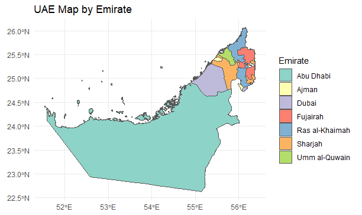

# uaeDB: UAE Data and Visualization Package

## Overview

**uaeDB** is an R package that provides datasets and tools for analyzing various aspects of the United Arab Emirates (UAE), including water production, population demographics, non-oil exports, and more. The package also includes a function to visualize the UAE map by Emirate.

## Features

- Access to multiple UAE datasets on topics like water production, population, exports, and more.
- Functions to load and explore datasets easily.
- Visualize UAE's Emirate boundaries with a built-in map plotting function.

## Installation

To install the package from GitHub, use the following commands:

```r
# Install devtools if you haven't already
install.packages("devtools")

# Install uaeDB from GitHub
devtools::install_github("Kosay/uaeDB")
```

## Usage

### Load the Package
```r
library(uaeDB)
```

### Example: Plot the UAE Map
The package includes a function to plot the UAE map by Emirate. To use it, simply call:

```r
uae.kml.all()
```

This function will generate a plot like the one below:



### Example: Load a Dataset
You can load various datasets using the provided functions. For example:

```r
# Load water production data
water_data <- uae.water()
head(water_data)

# Load population data
population_data <- uae.Population()
head(population_data)
```

## Available Datasets

| Function Name               | Description                                              |
|-----------------------------|----------------------------------------------------------|
| `uae.water()`               | Water production data across Emirates.                   |
| `uae.Population()`          | Population data by Emirate, nationality, and gender.     |
| `uae.non_oilExPorts()`      | Non-oil export data by HS code and year.                 |
| `uae.Meets.Import()`        | Meat import data by country and HS code.                 |
| `uae.2017.ElectricityTariff()` | Electricity tariff data by sector and authority.      |
| `uae.Death()`               | Death statistics by Emirate and gender.                  |
| `uae.Corp()`                | Agricultural data (crop details).                        |
| `uae.Cows()`                | Cattle and livestock data.                               |
| `uae.transport.2002()`      | Transport and ambulance data for 2002.                   |
| `uae.kml.all()`             | Plot UAE map by Emirate.                                 |

## Contribution

Feel free to contribute to this project by:
- Reporting issues
- Submitting pull requests
- Suggesting new datasets or features

## License

This package is licensed under the MIT License. See `LICENSE` for details.
